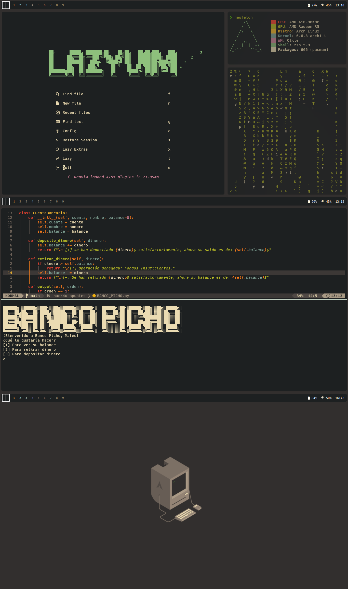

# DOTFILES DE MrMateo899
Estas son mis dotfiles personales para mi entorno de Qtile.

## INFO
- **SO:** [Arch Linux](https://archlinux.org/)
- **WM:** [Qtile](https://archlinux.org/) junto a [qtile-extras](https://github.com/elParaguayo/qtile-extras)
- **Term:** [Kitty](https://github.com/kovidgoyal/kitty)
- **Shell:** ZSH
- **Launcher:** [Rofi](https://github.com/davatorium/rofi)
- **Gestor de portapeles:** [greenclip](https://github.com/erebe/greenclip) (Requiere rofi)
- **Iconos:** [Viene de otro rice](https://www.pling.com/p/2046839/) Puedes encontrarlo en la sección de "files" y el archivo icons.zip)
- **GTK:** [Gruvbox-Dark-BL-MOD](https://www.pling.com/p/2046839)
- **Editor de texto:** [LazyVim](https://www.lazyvim.org/) con [gruvbox](https://github.com/ellisonleao/gruvbox.nvim)
- **Paleta de colores:** Gruvbox

## DEPENDENCIAS
Ejecute este comando en su terminal para instalar las dependencias que se pueden encontrar en los repos de core o extra de Arch Linux
~~~
pacman -S xdotools ripgrep feg pipewire-jack pipewire-alsa rofi
~~~
Ejecute este comando para instalar las dependencias disponibles en AUR (asumiendo que su AUR helper es yay)
~~~
yay -S qtile-extras rofi-greenclip
~~~
Además de estas dependencias se recomienda instalar [Hack Nerd Font](https://github.com/ryanoasis/nerd-fonts/releases/download/v3.1.1/Hack.zip) para evitar problemas con las fuentes.

## SHOWCASE

