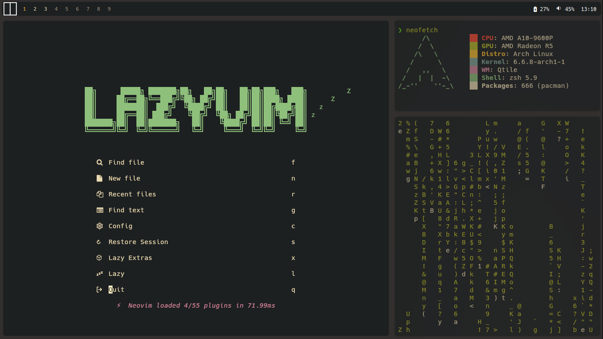
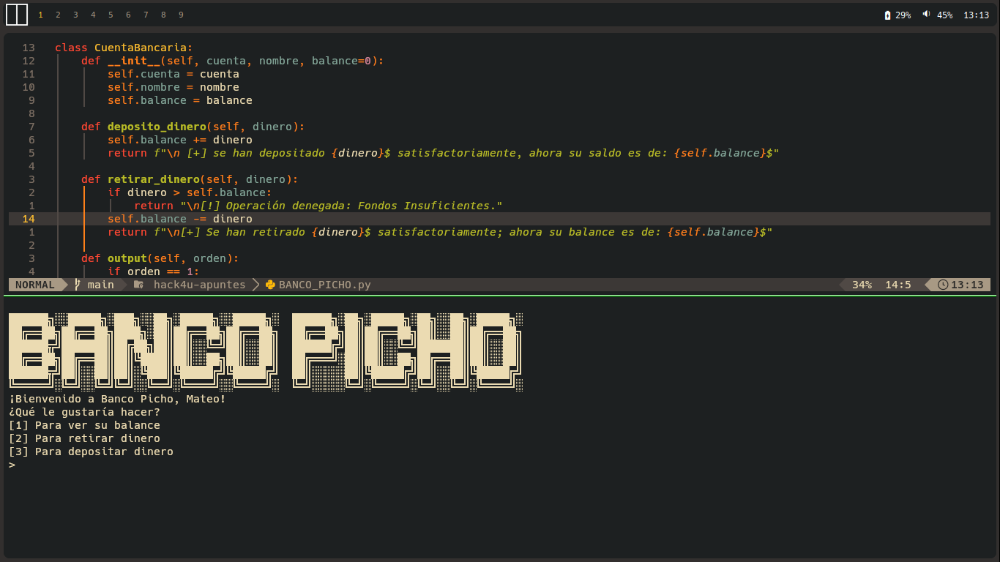
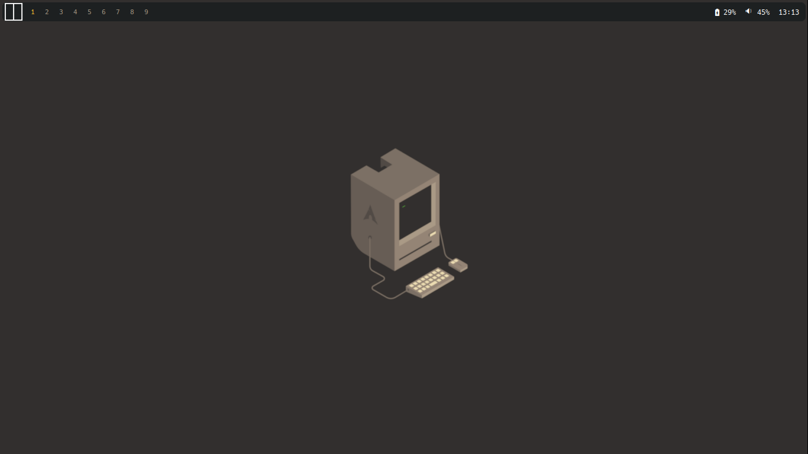

# DOTFILES DE MrMateo899
Estas son mis dotfiles personales para mi entorno de Qtile.

## INFO
- SO: [Arch Linux](https://archlinux.org/)
- WM: [Qtile](https://archlinux.org/) junto a [qtile-extras](https://github.com/elParaguayo/qtile-extras)
- Term: [Kitty](https://github.com/kovidgoyal/kitty)
- Shell: ZSH
- Launcher: [Rofi](https://github.com/davatorium/rofi)
- Gestor de portapeles: [greenclip](https://github.com/erebe/greenclip) (Requiere rofi)
- GTK: [Gruvbox-Dark-BL-MOD](https://www.pling.com/p/2046839/) (Puedes encontrarlo en la sección de "files" y el archivo themes.zip)
- Editor de texto: [LazyVim](https://www.lazyvim.org/) con [gruvbox](https://github.com/ellisonleao/gruvbox.nvim)
- Paleta de colores: Gruvbox

## DEPENDENCIAS
Ejecute este comando en su terminal (asumiendo que su AUR helper es yay)
~~~
pacman -S xdotools ripgrep feg pipewire-jack pipewire-alsa rofi
~~~
###### Ya ni recuerdo que otras dependencias necesito XDDDD

## SHOWCASE

